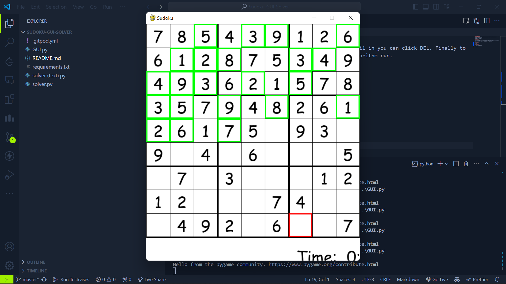
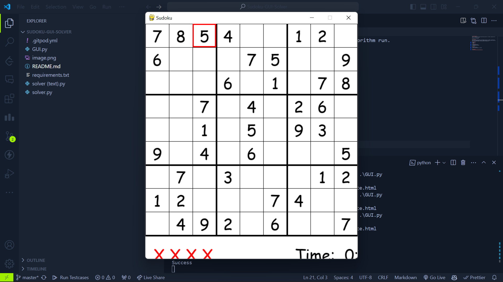

# Sudoku-GUI-Solver
This is a sudoku solver using the backtracking algorithm. It includes a graphical GUI as well as a text based version.

Run GUI.py to play sudoku.

# Instructions
Click a box and hit the number on your keybaord to pencil in a number. To confirm that value press the ENTER key on that box. To delete a pencil in you can click DEL. Finally to solve the board press SPACE, sit back and watch the algorithm run.

# Requirements
- Python 3.x
- Pygame

# Installation
1. Clone the repository
2. Install the requirements
3. Run GUI.py

# Features
- Solve sudoku board
- Select a box and pencil in a number
- Press ENTER to confirm the number
- Press DEL to delete the number
- Press SPACE to solve the board using backtracking

# Screenshots

